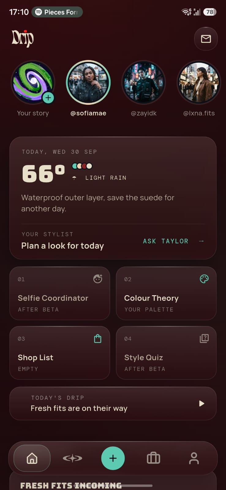
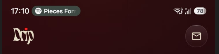
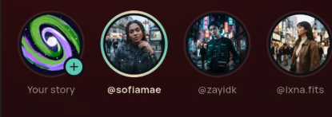
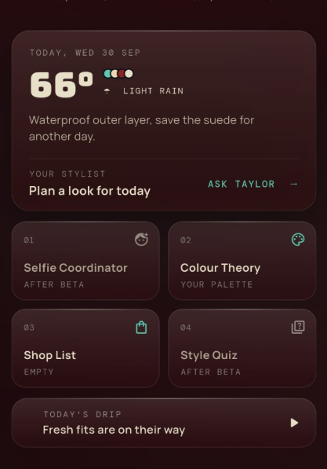
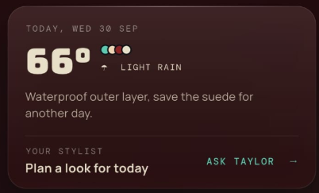
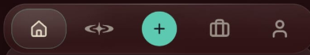
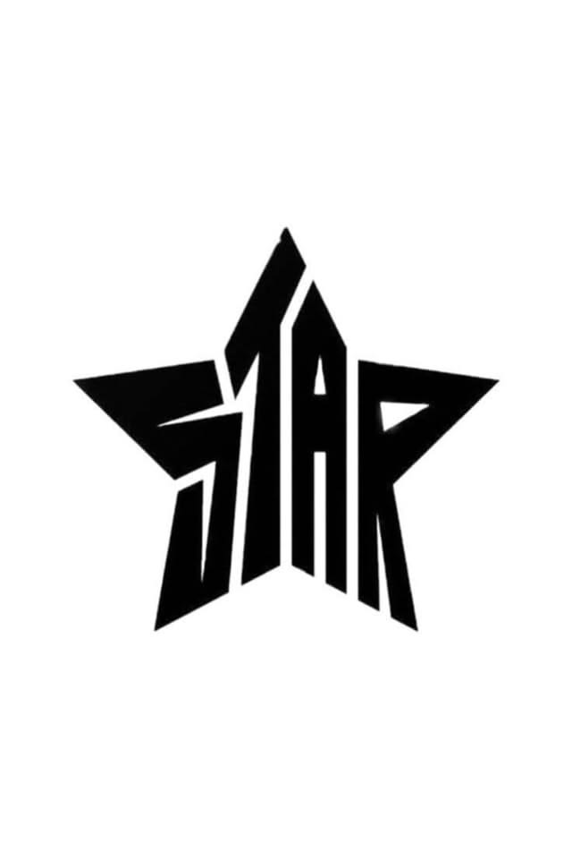

THIS DOC CONTAINS THE DESIGN AMNEDS RELATED TO THE CURRENT STRUCTURE OF THE APP AS OF 27-09-2026

1. ONBOARDING:
 Use the claude_design MCP (https://api.anthropic.com/v1/design/mcp, auth via /design-login) to import this project:
https://claude.ai/design/p/6e87c76c-325c-4fa7-8614-f9dca1ee5dcd?file=Drip+Onboarding.dc.html

Focus on these files (the whole project is readable):
- `Drip Onboarding.dc.html`

Also read these files the selection imports:
- `assets/drip_wordmark_light.svg`
- `assets/drip_wordmark.svg`
- `support.js`

Implement: `Drip Onboarding.dc.html`

implement this onboarding design in the app

2. home page: 
 needs alot of amends in this page: 
    1. top section of the page  i want the drip logo to be places in the middle and a "+" to be in the left, similar to how it is in insta, so that when the user has the need to click any thing they swip left and go to the camera page, of the app. 

    2. , for now let's remove the story feature for V1 Of the app, it will be re introduced in the future so, just keep the user's circle but remove the other from here. 

    3. : the spacing and the highlited part of each button card needs more work, like the buttons need to be more visible to the user, not too much in the face. but visible enough.  

    4. , represent the colours of the day in this card in a better way, in a way that the colours are more visible to the user, rest of the elements in the  card remains the same. 

3. Nav bar: , instead of the "+" in the nav bar we're gonna keep , something like this, and when the user clicks on it, it should take the user to "studios" feature of the app. 
we are removing the "+" from the home page and its functionality from the nav bar completely, that "+" button will be placed in the top section of the home page, with the logo on the right,

